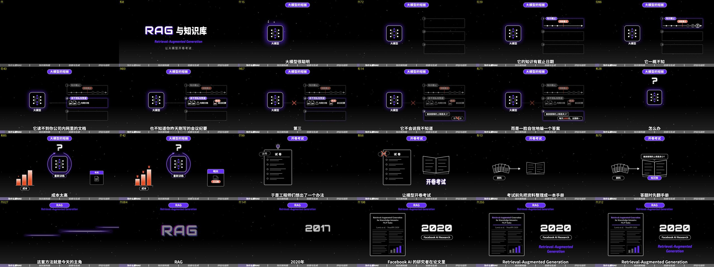

# anything2explainer

[](https://claude.com/claude-code)
[](https://openai.com/codex)
[](https://remotion.dev)
[](LICENSE)

**English** | [简体中文](README_ZH.md)

Give it a topic → get a **narrated explainer video** (Chinese or English) in a black-canvas motion-graphics style, with subtitles, chapter progress bar and a top HUD. You choose the length and the language; 3–5 minutes is typical.
Every frame is drawn in code (Remotion + React). No stock footage, no frames lifted from anyone else's video.

This is a **Claude Code / Codex skill**. What ships here isn't a CLI — it's the whole method an agent needs to finish the film: a compilable template project, a primitives and lighting library, tooling for voiceover / storyboard / rendering / quantitative QC, written style and motion specs, a multi-agent division-of-labour protocol, and one complete reference film as the quality bar.



Reference film *RAG and Knowledge Bases*: 4′35″, 44 narration lines, 44 shots, 8 build agents in parallel for 40 minutes, two QC rounds.
Its full paper trail lives in [`examples/rag/`](examples/rag/) (research → narration → storyboard → shot source → QC reports → delivery notes); rendered frames are in [`examples/rag/frames/`](examples/rag/frames/).

## Output spec

| | |
|---|---|
| Frame / rate | 1280×720 @ 30fps, H.264 |
| Length | your call (see table below); 2–8 minutes all work |
| Language | Chinese or English (`lang` in `src/config.ts`); typography, subtitle budgets and TTS switch with it |
| Look | black canvas + star dots + fog gradient; white line art + purple accents; ultra-bold headline type |
| Persistent layers | 44px white-on-black-stroke subtitles, bottom chapter progress bar, top capsule HUD, optional pipeline rail |
| Voiceover | Chinese: edge-tts `zh-CN-YunxiNeural` (Yunxi, male). English: kokoro-82m `am_liam` (Liam, male). Or bring your own TTS / finished audio |

Length drives how much ground the film covers, and the size of the whole pipeline:

| Length | Chinese chars | English words | Lines / shots | Chapters | Build agents | Wall clock | Disk |
|---|---|---|---|---|---|---|---|
| 2–3 min | 700–950 | 280–420 | 24–32 | 3 | 4–6 | ≈1.5 h | ≈2 GB |
| 3–5 min (reference tier) | 1200–1500 | 420–700 | 40–50 | 4 | 8 | ≈3 h | ≈2 GB |
| 5–8 min | 1800–2400 | 700–1150 | 60–80 | 5–6 | 10–14 | ≈4–5 h | ≈3 GB |

## Install

```bash
git clone https://github.com/Vincentwei1021/anything2explainer.git
ln -s "$PWD/anything2explainer" ~/.claude/skills/anything2explainer   # Claude Code
ln -s "$PWD/anything2explainer" ~/.codex/skills/anything2explainer    # Codex
```

Dependencies:

```bash
# Node ≥18 (the template's npm install pulls remotion 4.0.507 / react 19)
brew install ffmpeg          # frame extraction / transcoding, required

python3 -m venv ~/.venvs/a2e && source ~/.venvs/a2e/bin/activate
pip install 'edge-tts==7.2.8' numpy pillow scipy   # pin edge-tts: it tracks a Microsoft endpoint and breaks across upgrades

# only needed for English narration (kokoro-82m runs locally)
pip install kokoro soundfile && brew install espeak-ng
```

`scipy` is only used by the QC script `frame_metrics.py`. The shell scripts are zsh + Python 3, developed and verified on macOS; Linux should work, Windows is untested.

## Usage

In Claude Code, just say what you want — the skill triggers itself:

> 讲一下向量数据库，做成一条讲解视频
> (Make me an explainer video about vector databases)

It then walks the 9 stages in `SKILL.md`: scaffold → research (1 agent) → narration & timeline → storyboard → overlays & primitives → pilot (1 agent + a 30-second cut) → parallel build (the remaining groups) → render → QC & fixes → delivery.

You can also drive the template by hand:

```bash
template/scripts/new_project.sh ~/work/my-video myslug
cd ~/work/my-video
# 1. research/调研.md          2. script/narration.txt → python3 scripts/tts_build.py
# 3. script/storyboard_src.md → python3 scripts/render_storyboard.py     4. edit src/config.ts
# 5. src/shots/G1..Gn          6. scripts/preview.sh 30   (first 30 seconds)
# 7. VER=v1 scripts/render.sh + python3 scripts/frame_metrics.py         8. QC → fix → v2/v3
```

## Four checkpoints

The run stops and waits for you at exactly four points instead of ploughing through (details in `SKILL.md`):

1. **Length and language** — before the script is written. Length decides the chapter count, line count, shot count and how many agents run in parallel, i.e. how much the film can actually cover; language flips `lang` in `src/config.ts`, which drives typography, subtitle budgets and the default voice.
2. **Narration sign-off** — before voiceover. Once locked, frame numbers are hard-coded into every shot; changing one word re-times the whole film. This is the cheapest place to intervene.
3. **Voiceover** — before TTS runs you get asked whether you have a preferred engine. If not, defaults apply (edge-tts Yunxi for Chinese, kokoro-82m Liam for English). You can also hand over finished audio and fill the per-line timeline yourself.
4. **First 30 seconds** — only the first build group is done, then 30 seconds get rendered for you to judge the look. Fixing the style here costs one group; after the full render it costs every group.

## Repo layout

```
SKILL.md                  the process: 9 stages, four checkpoints, quality bar
reference/                specs written for the main session and the agents
  style-guide.md            safe areas, palette, fonts, primitive catalogue, layout habits
  motion-vocabulary.md      entrance / emphasis / light / exit / camera formulas and frame counts
  composition-and-light.md  three size tiers, light follows the hero, set-piece choreography, QC metrics
  narration-storyboard.md   how to write narration, voiceover params, storyboard tokens, shot pattern table
  research-brief.md         researcher prompt and fact rules
  agent-build-rules.md      build-agent protocol
  agent-qc-rules.md         QC-agent protocol
  prompts.md                six prompt templates: research / build / QC / fix / recheck / final pass
  lessons.md                every trap hit across three films, with root causes
template/                 the compilable Remotion 4 project (copy it with scripts/new_project.sh)
  src/common/               fog, star field, glitch, easings, subtitles, progress bar, footage layer
  src/ui.tsx  src/fx.tsx    primitives and palette / light, depth and camera primitives
  src/overlay/              title, chapter cards, HUD, pipeline rail, ending
  scripts/                  voiceover, storyboard, stills, test render, 30s preview, full render, QC metrics
  public/fonts/             four fonts + their OFL licence
examples/rag/             the reference film's full paper trail and rendered frames
examples/contrast/        6 bad/good frame pairs — the yardstick for composition and light
```

## Acknowledgements

The visual language and the quality bar are inspired by the Douyin creator **@图灵宇宙** — black canvas, white line art with purple accents, ultra-bold headline type: that vocabulary was learned from their videos. Everything in this repo is drawn from scratch in code; none of their frames, assets or project files are used. If you feel this crosses a line, please open an issue.

## Originality

- **Every frame is drawn in code.** No frames or clips from existing videos. Optional live-action B-roll must come from royalty-free sources and be logged in a MANIFEST (sha256 / source URL / licence / usage).
- **Every fact is sourced.** Every number, year, organisation and English term shown on screen must trace back to a source URL in that film's research document. Anything unverified stays off the screen and out of the narration.

## Licence

The toolkit: [PolyForm Noncommercial 1.0.0](LICENSE) — free for noncommercial use; commercial use requires prior authorization from the author. **Videos you make with it are yours.**
The four bundled fonts (Noto Sans SC / Orbitron / Exo 2 / Audiowide) are licensed separately under SIL OFL 1.1; see [`template/public/fonts/LICENSE.md`](template/public/fonts/LICENSE.md).
Remotion itself has its own licence terms for companies — see [remotion.dev/license](https://remotion.dev/license).

## Known limits

- Chinese and English are both supported (`lang: 'zh' | 'en'`), each with its own pacing, subtitle budget (16 chars / 48 characters per block) and default voice. The reference film is Chinese — an English film has no reference cut yet, though the visual grammar is language-neutral. One visual style only; changing it means editing `reference/style-guide.md` + `src/ui.tsx`.
- Not for: replicating an existing video, talking-head presenter footage, or films that are mostly live action.
- Once the narration is voiced, the words are frozen — shot code hard-codes frame numbers, so a rewrite re-times everything.
- Parallel builds are demanding: several agents bundle Remotion at once, so keep ≥5 GB free; tmux panes are capped, so past ~12 you have to dispatch in waves.
